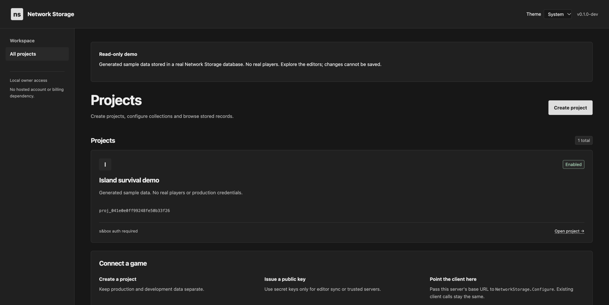
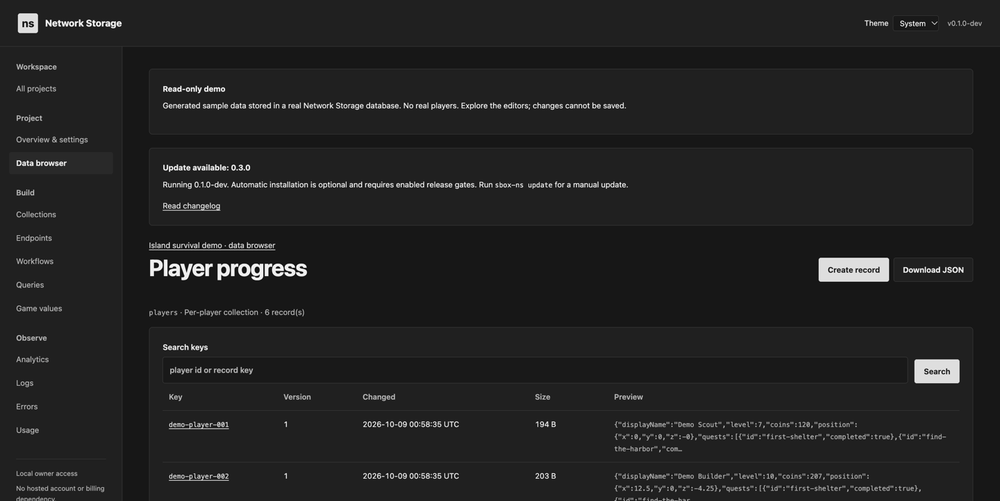
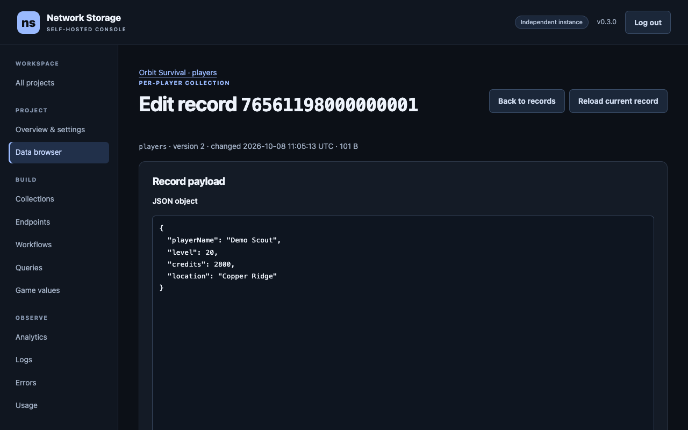
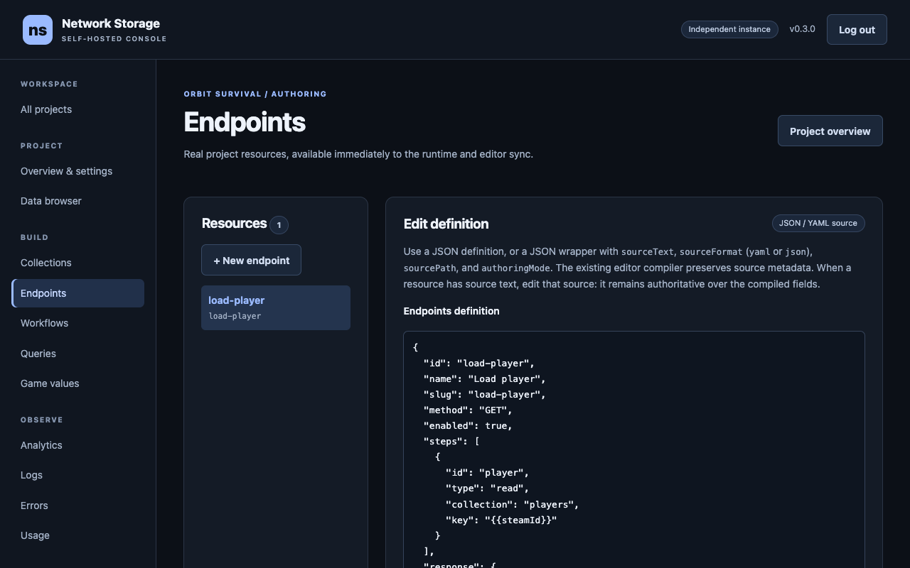

# sbox Network Storage Server: open-source, self-hosted s&box game backend

**The central server your s&box game was missing. Player-hosted or dedicated, point your saves, leaderboards and stats at a backend you own.**
Your players host the game. You host the truth. No sboxcool signup, payment, or mandatory telemetry.
One self-contained `sbox-ns` binary runs player saves, leaderboards, endpoints
and workflows on your own machine or VPS, with SQLite or PostgreSQL.

**Try it without installing:** explore the read-only
[live demo](https://demo.sboxns.com) running generated sample data.
No login needed; every change is disabled server-side.

## Why self-host

- **Stable address, movable server.** Opt in to a free `sboxns.com` name and
  your game keeps one HTTPS URL while the server underneath can move: point
  the name at a new IP and players reconnect with no game update. Use a
  Cloudflare Tunnel when you have no open ports, signed DNS when you have a
  public IP, or your own domain and certificate instead.
- **Same game code.** The existing Network Storage library only needs your
  project credentials and base URL. Secret keys stay in editor tooling and
  trusted servers, never in published games.
- **Owner dashboard, no hosted account.** Browse records, author collections
  and endpoints, read analytics and logs, and export portable project
  archives from `/dashboard` on your own server.

## Hosting models

Your game can be fully player-hosted or run on dedicated servers: either way,
currency, XP, levels, items, high scores and every other important rule run on
this backend, behind the HTTPS endpoint you control. A player's listen server
only ever holds the public key; a dedicated box may hold a secret key for
dedicated-only endpoints. See [docs/hosting-models.md](docs/hosting-models.md)
for where authority lives, which key each caller uses, and why secret keys
never ship in games.

## Gallery

Real screenshots. The first two are the public
[demo](https://demo.sboxns.com); the last two are an owner's own server.
Click any thumbnail for the full image.

| | |
| --- | --- |
| <a href="docs/images/demo-dashboard.png"></a><br>**Project dashboard** with generated sample data | <a href="docs/images/demo-player-records.png"></a><br>**Player records** with levels, coins and quests |
| <a href="docs/images/owner-record-editor.png"></a><br>**Record editor** with schema validation and conflict protection | <a href="docs/images/owner-resources.png"></a><br>**Backend authoring** with the same compiler as editor sync |

## Quickstart: Linux VPS to s&box game

On your Linux VPS with systemd, one command installs the server, creates
**My Game** with API keys, gives it a free HTTPS name and starts the service.
No open ports are needed for the tunnel path:

```sh
curl -fsSL https://github.com/sbox-cool/sbox-network-storage-server/releases/latest/download/install.sh \
  | sudo env SBOX_NS_PROJECT="My Game" SBOX_NS_TUNNEL=1 sh
```

With a public IP and open ports 80/443, choose signed DNS instead: players
connect straight to your server, and the name follows your IP when it moves.

```sh
curl -fsSL https://github.com/sbox-cool/sbox-network-storage-server/releases/latest/download/install.sh \
  | sudo env SBOX_NS_PROJECT="My Game" SBOX_NS_DNS=1 \
    SBOX_NS_ACME_EMAIL="you@example.com" SBOX_NS_ACCEPT_LETSENCRYPT_TERMS=1 sh
```

Save the printed project ID, public key, editor secret key and
`NetworkStorage.Configure(...)` line. A new secret key is shown only once.
Service files live in `/etc/sbox-ns/`, data in `/var/lib/sbox-ns/`.

**The HTTPS tunnel is optional, and is explicitly enabled by this command.**
It needs no domain purchase, sboxcool account or payment, but traffic passes
through **Cloudflare**. Hosted-name registration necessarily shares operational
metadata with the registry; it does not upload your database contents.
Cloudflare handles proxied requests, and its optional `cloudflared` connector
has its own crash reporting. This is not a promise that tunnel traffic avoids
third parties. See [hosted HTTPS and acceptable use](docs/self-hosting.md#hosted-https-without-a-domain).

To avoid the hosted tunnel, omit `SBOX_NS_TUNNEL=1` and supply
`SBOX_NS_PUBLIC_URL="https://ns.example.com"` alongside `SBOX_NS_PROJECT`;
configure [your own HTTPS or reverse proxy](docs/self-hosting.md#https).
The public URL setting alone does not configure TLS.
Usage statistics remain off and email registration is not enabled by the
non-interactive command above.

### 2. Install the library and point your game at your server

In **Editor > Library Manager**, install
[Network Storage by sboxcool.com](https://sbox.game/sboxcool/network-storage).
For a code-based setup, use the project ID, **public key** and actual HTTPS
hostname printed by the installer:

```csharp
NetworkStorage.Configure( projectId, publicKey, "https://<name>.sboxns.com" );
```

Replace `<name>` with your assigned name. The base URL is the scheme and
hostname (and port if needed), with no path or trailing slash; the library
adds `/v3/...` itself. **Never put the secret key in published game code.**

For editor setup, open **Editor > Network Storage > Setup**, enter your
server's **Project ID**, **Public API Key** and **Secret Key**, and set
**Base URL** to the same HTTPS URL. Leave **CDN URL** empty unless you operate
one. Save the configuration. The library can use the editor-generated
configuration at runtime instead of a manual `Configure()` call.

### 3. Author YAML definitions and sync them to your own server

Open **Editor > Network Storage > Sync Tool**. Author collections, endpoints
and workflows under your game's `Editor/Network Storage/` folder using
**YAML Source** (`.yml` preferred; `.yaml` also accepted), then push them to
the server selected by your editor's Base URL and project credentials.

```text
Editor/Network Storage/
  collections/players.collection.yml
  endpoints/load-player.endpoint.yml
  workflows/validate-purchase.workflow.yml
```

**Sync transfers resource definitions, not runtime player saves.** Collection
schemas, endpoint logic, workflows and authored game values are configuration.
Player records created while the game runs are stored in collections in your
server's SQLite or PostgreSQL database; they are not YAML save files.
Pointing at a new server and syncing definitions does **not** copy existing
player records from the managed service.

Use the [official YAML Source guide](https://sboxcool.com/wiki/network-storage-v3/core-concepts/source-authoring)
and [Sync Tool guide](https://sboxcool.com/wiki/network-storage-v3/security-production/sync-tools)
for resource formats and editor workflows.
[Self-hosted client setup](docs/client-setup.md) covers Base URL configuration
and migration caveats; [game-client handshakes](docs/game-client.md) explains
what the library calls.

## AI agents, MCP and the operator CLI

One binary is both the server and CLI. Provision a project independently of
the installer, or get machine-readable output for automation:

```sh
sbox-ns quickstart "My Game" --public-url https://ns.example.com --json
```

Quickstart is idempotent: it creates or reuses the project and ensures keys.
**Treat JSON output as secret material.** It does not configure HTTPS on its own.
Separate `project create` and `key create` commands remain available.

`sbox-ns mcp` exposes allowlisted tools over **stdio**, locally or through SSH,
not an extra public network service. Besides setup and operations (status,
quickstart, keys, configuration, backups, tunnel), agents can read and validate
collection and endpoint YAML, dry-run endpoints, read request logs, errors and
player records, and get the C# to call an endpoint. Saving definitions,
changing records and deleting anything stay off until the operator turns on
`mcp.allow_writes`, `mcp.allow_data_writes` or `mcp.allow_destructive`.
Database restore and import are never tools. Follow the
[MCP guide](docs/mcp.md) for connection, permissions and the tool list.

For Claude Code, this repository is a plugin marketplace with the MCP server
and skills for setup, design, debugging and operations:
`/plugin marketplace add sbox-cool/sbox-network-storage-server`, then
`/plugin install sbox-ns@sbox-ns`.

- [llms.txt](llms.txt): focused documentation index for AI assistants.
- [AGENTS.md](AGENTS.md): repository contributor context and constraints.
- [Official API and library documentation](https://sboxcool.com/wiki/network-storage-v3).
- [Official C# library reference](https://sboxcool.com/wiki/network-storage-v3/getting-started/library-reference).
- [Official code examples](https://sboxcool.com/wiki/network-storage-v3/code-examples).
- [Client library source](https://github.com/sbox-cool/sbox-network-storage).

The official wiki also covers the managed service. Its billing, package tiers,
dashboard URLs and default API hostname are not self-hosted setup requirements.
Use this repository's guides for operating your server.

## Other installation paths and administration

- [Linux and macOS interactive installation](docs/self-hosting.md#linux-and-macos):
  non-root/macOS installs may require `sbox-ns start` after setup.
- [Windows PowerShell installation](docs/self-hosting.md#windows).
- [Docker and Docker Compose](docs/self-hosting.md#docker), including persistent
  config/data volumes and PostgreSQL.
- [Manual binary installation](docs/self-hosting.md#manual-install).
- [Full self-hosting guide](docs/self-hosting.md), [configuration reference](docs/configuration.md)
  and [database guide](docs/database.md).

For remote owner setup or sign-in, run `sbox-ns admin login-link` on the server
and open its single-use link. Use HTTPS or an SSH tunnel for remote access.
The local-owner dashboard at `/dashboard` manages projects, keys, settings,
collection records, resource definitions and portable exports:
[admin panel guide](docs/admin-panel.md), [backup/export guide](docs/export.md).
`GET /health` reports server health.

### Owner dashboard

The local-owner dashboard at `/dashboard` manages projects, keys, settings,
collection records, resource definitions and portable exports:
[admin panel guide](docs/admin-panel.md), [backup/export guide](docs/export.md).
For remote sign-in, run `sbox-ns admin login-link` on the server and open its
single-use link over HTTPS or an SSH tunnel. `GET /health` reports health.

**Move a project.** Download its private archive and import it on another
self-hosted SQLite or PostgreSQL instance. The original project ID is retained;
existing projects are never overwritten. Create a new destination secret key
and update your server base URL.
[Project migration details](docs/admin-panel.md#move-one-project).

## Features and privacy defaults

- **Player and shared data:** per-player records keyed by Steam ID, global
  collections, named queries and leaderboards.
- **Server authority:** endpoints and workflows execute on your server; game
  values, player auth sessions and per-project rate limits support controlled
  data access.
- **Two databases:** zero-config SQLite or PostgreSQL with a dedicated schema.
- **One binary:** server and operator CLI, self-contained release builds for
  Linux, macOS and Windows, plus a Docker image.
- **Opt-in automatic updates:** off by default. `sbox-ns update` installs a
  release manually; `update --auto` with a channel and UTC window enables
  gated unattended updates with backup, health checks and rollback.
- **Optional usage statistics:** off by default. If enabled, reports include a
  random statistics-only ID, platform/version, installation flags, uptime and
  aggregate project/player counts—not player records or database contents.
  [Exact fields and opt-in controls](docs/self-hosting.md#anonymous-usage-statistics-opt-in).
- **Optional email notices:** registration sends an email address, installed
  version and random install ID; notices require confirmation. No signup is
  required to run the server.
  [Email registration details](docs/self-hosting.md#optional-security-and-update-email-notices).

## Preview status and compatibility caveats

> **Early preview, pre-1.0.** Configuration and storage formats may change
> between releases; keep backups. Releases are gated on an approved managed-service
> HTTP contract recording, with reviewed
> [intentional differences](tests/parity/intentional-differences.json).
> This does not establish end-to-end s&box client reachability.
> Full managed-dashboard and managed project export/import parity are not
> established. This server's owner console supports resource authoring and
> self-hosted project portability; editor source sync remains supported.


### Client reachability

Which kinds of URL s&box game clients can reach has not been verified yet.
Every row is **untested**; reports are welcome.

| Server URL type | Example | Status |
| --- | --- | --- |
| HTTPS domain | `https://ns.example.com` | **untested** |
| HTTP domain | `http://ns.example.com:8080` | **untested** |
| IP address and port | `http://203.0.113.10:8080` | **untested** |
| localhost | `http://localhost:8080` | **untested** |

## Configuration

Settings live in a folder of commented TOML files:

```text
server.toml      listener, TLS, logging, auth
database.toml    SQLite or PostgreSQL
updates.toml     update notices
conf.d/*.toml    optional overrides
```

The folder is `/etc/sbox-ns/` for Linux service installs (data in
`/var/lib/sbox-ns/`) and `<install dir>/config/` otherwise. Edit a file and
restart to apply.

Precedence, lowest to highest: built-in defaults, the main files, `conf.d/*.toml`,
`NS_` environment variables, command line flags (`--config-dir`, `--data-dir`,
`--listen`). Environment variables are `NS_` plus the key path in upper case
with `.` replaced by `__`, for example `NS_SERVER__LISTEN=0.0.0.0:9000` or
`NS_DATABASE__POSTGRES__PASSWORD_FILE=/run/secrets/pg`. `NS_CONFIG_DIR` and
`NS_DATA_DIR` choose the folders.

Every key with its default: [docs/configuration.md](docs/configuration.md).

## CLI reference

| Command | Purpose |
| --- | --- |
| `sbox-ns start [--listen ADDR]` | Run the server in the foreground |
| `sbox-ns setup [--non-interactive ...]` | Create the configuration interactively, or from flags (`--database`, `--pg-host`, `--listen`, `--public-url`) |
| `sbox-ns quickstart <name> [--public-url URL] [--json]` | Configure a new server and create or reuse a project and keys |
| `sbox-ns config path\|show\|get <key>\|set <key> <value>\|validate\|edit` | Locate, inspect and edit configuration |
| `sbox-ns db test\|status\|migrate` | Database connectivity, status and migrations |
| `sbox-ns db backup [--output FILE]` / `db restore <FILE>` | Back up and restore (SQLite file copy; PostgreSQL via `pg_dump`/`pg_restore`) |
| `sbox-ns export [--out FILE] [--no-secrets]` / `import <FILE> [--config]` | Portable, driver-neutral server backup and restore ([guide](docs/export.md)) |
| `sbox-ns admin login-link [--public-url URL]` | Create a short-lived, single-use owner sign-in or setup link |
| `sbox-ns mcp` | Serve tools for coding agents over stdio ([guide](docs/mcp.md)) |
| `sbox-ns tunnel enable\|status\|disable` | Manage the optional hosted HTTPS connector |
| `sbox-ns register --email ADDRESS` / `register --remove` | Opt in to confirmed security/update email notices or remove the subscription |
| `sbox-ns telemetry status\|enable\|disable\|preview` | Inspect, opt in to, opt out of, or preview the anonymous usage statistics (off by default) |
| `sbox-ns project create <name>\|list\|delete <projectId>` | Manage projects |
| `sbox-ns key create <projectId> --type public\|secret [--label L]` | Create an API key |
| `sbox-ns key list <projectId>` / `key revoke <projectId> <key>` | List and revoke API keys |
| `sbox-ns service install\|uninstall\|start\|stop\|restart\|status` | Run as a systemd unit (Linux), launchd job (macOS) or Windows service |
| `sbox-ns logs [-f]` | Show or follow server logs |
| `sbox-ns update [--check] [--version vX.Y.Z]` | Check for or install a release |
| `sbox-ns rollback` | Return to the previous release |
| `sbox-ns layout migrate [--revert]` | Linux, root: move runtime files (secrets, tunnel/DNS state) out of the config folder into `<data dir>/state`, or back |
| `sbox-ns version` | Print version information |
| `sbox-ns doctor` | Diagnose configuration, database, ports and update status |

Commands accept `--config-dir` and `--data-dir` to select the folders.

## Databases

| Backend | Best for | Setup |
| --- | --- | --- |
| SQLite (default) | Solo dev or a single server, zero config | Nothing to do. One file in the data folder. |
| PostgreSQL 13 or newer | Operators who already run Postgres, or a database on a separate machine | Set `provider = "postgres"` in `database.toml`; check with `sbox-ns db test`. Full spec: [docs/database.md](docs/database.md). |
| ScyllaDB | Not applicable | Not supported by this server. `database.provider` accepts `sqlite` or `postgres` only. |

PostgreSQL in `database.toml`:

```toml
[database]
provider = "postgres"

[database.postgres]
host = "localhost"
port = 5432
database = "sbox_ns"
username = "sbox_ns"
password_file = "/etc/sbox-ns/pg-password"   # or password = "..."
schema = "network_storage"                   # all tables live in this schema
ssl_mode = "Prefer"
```

A full `connection_string` may be used instead of the individual fields.
Check it with `sbox-ns db test`. Back up with `sbox-ns db backup` and restore
with `sbox-ns db restore` (stop the server first). Details: [docs/database.md](docs/database.md).

## Updates

By default the server never updates itself. It checks for new releases (by
default once a day) and shows a notice in the logs and in `sbox-ns doctor`,
flagging security fixes and required migrations. On Linux you can opt in to
unattended updates inside a nightly window, with health checks and automatic
rollback: `sudo sbox-ns service install --auto-update` (see
[Automatic updates](docs/self-hosting.md#automatic-updates)).

```sh
sbox-ns update --check   # is there a new version?
sbox-ns update           # install it
sbox-ns rollback         # go back to the previous version
```

To disable update checks, set `check = false` under `[updates]` in `updates.toml`.

## Self-hosted vs managed

| | Self-hosted (this repo) | Managed ([sbox.cool](https://sbox.cool/tools/network-storage)) |
| --- | --- | --- |
| Cost | Free, you pay for your own server | See sbox.cool |
| Hosting, uptime, scaling | You | sbox.cool |
| Database | SQLite or PostgreSQL you operate | Managed |
| Backups | You (`sbox-ns db backup`) | Managed |
| Updates | Manual, with notices | Automatic |
| Management | `sbox-ns` CLI and the editor Sync Tool | sbox.cool web dashboard and the editor Sync Tool |
| Data location | Your machine | sbox.cool infrastructure |
| Client library | Same, change the base URL | Same, default base URL |
| Source code | AGPL-3.0, this repo | Closed |
| Support | GitHub issues | sbox.cool |

## Compatibility

Server releases are tested against specific versions of the s&box client
library. This table is filled in per release.

| Server version | Client library version | Notes |
| --- | --- | --- |
| _to be filled per release_ | _to be filled per release_ | |

## Building from source

```sh
dotnet build SboxNetworkStorage.sln
dotnet test
dotnet run --project src/SboxNetworkStorage.Server -- start
```

Requires the .NET 10 SDK selected by `global.json`. See [CONTRIBUTING.md](CONTRIBUTING.md).

## Security

Please report vulnerabilities privately, see [SECURITY.md](SECURITY.md).

## Contributing

Issues and pull requests are welcome. Read [CONTRIBUTING.md](CONTRIBUTING.md)
first, and open an issue before large changes. Reports on which client
reachability rows work are especially useful.

## License

[GNU Affero General Public License v3.0](LICENSE) (AGPL-3.0-only). If you run a
modified version of this server for others over a network, you must offer them
the source code of your modified version.

s&box is a trademark of Facepunch Studios. This project is not affiliated with
or endorsed by Facepunch Studios.
